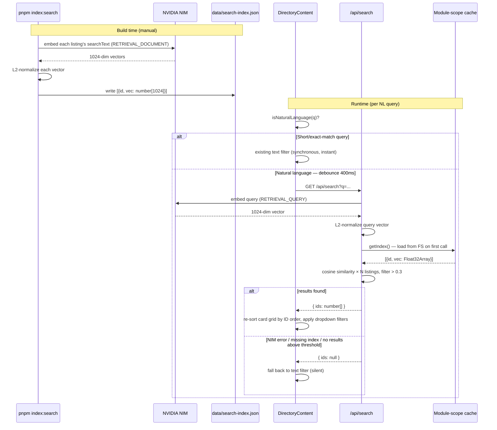

# feat: Add AI semantic search with NVIDIA NIM embeddings

## Summary

Implement pre-computed vector search for the `/directory` page: a build-time script that embeds all listings via NVIDIA NIM `baai/bge-m3` and writes a `data/search-index.json`; a `/api/search` GET route that embeds natural-language queries and returns cosine-ranked stay IDs; and targeted additions to `DirectoryContent.tsx` that consume AI-ranked IDs with graceful degradation to the existing client-side text filter when AI search is unavailable or returns no results.

---

## Problem Frame

The existing directory search is pure client-side substring matching — it has no concept of geographic semantics, synonyms, or vibe. Queries like "Treehouses near the California redwoods with a hot tub" return zero results. See origin spec for approach rationale and alternatives rejected. (see origin: `docs/superpowers/specs/2026-05-08-ai-search-design.md`)

---

## Requirements

- R1. Natural-language queries return semantically relevant stays ordered by embedding similarity
- R2. Short or exact-match queries (≤2 words, known category/region/platform term) bypass the AI path and use the existing synchronous text filter
- R3. Dropdown filters (category, region, platform) remain composable on top of AI-ranked results
- R4. AI search failure (NIM unavailable, missing index, no results above threshold) is invisible to the user — graceful fallback to text filter
- R5. Build-time index generation is a manual, on-demand script (`pnpm index:search`); not wired into `next build`
- R6. `data/search-index.json` is never served to browsers; it lives outside `/public`
- R7. Per-NL-query cost stays near zero; no LLM call per query in v1

---

## Scope Boundaries

- No HyDE query expansion (v2 extension point documented in spec — no scaffolding needed)
- No homepage "describe your dream stay" hero search
- No BM25 + vector hybrid re-ranking
- No Claude-enriched searchText generation
- No streaming results or search analytics
- No automated test framework setup — test infrastructure is a prerequisite deferred to implementation

### Deferred to Follow-Up Work

- Test infrastructure (Vitest recommended for ESM-only stack): separate PR once the feature ships
- Documenting NIM API patterns, null-vs-empty fallback contract, and Float32Array timing to `docs/solutions/` — after the feature is live

---

## Context & Research

### Relevant Code and Patterns

- `src/app/(app)/directory/_directory/DirectoryContent.tsx` — current filter state shape, useMemo chain, REGIONS const (to be extracted); target file for AI integration
- `src/lib/categories-config.ts` — `CATEGORIES_CONFIG` (used in isNaturalLanguage detection)
- `src/lib/spokes-config.ts` — `SPOKES_CONFIG` / `SPOKE_SLUGS` (used in searchText template)
- `src/lib/types.ts` — `NormalizedStay` shape (`id: number`, `category` as slug string, `spokes` as string[], `tags` as `{tag: string}[]`)
- `src/lib/payload-queries.ts` — `getAllStays()` wrapped in `unstable_cache`; build script should call this
- `src/app/keep-alive/route.ts` — the only prior custom API route; sets the pattern: `export const maxDuration`, plain `Response`/`NextResponse.json`, try/catch body
- `scripts/migrate-images.ts` — only existing build script; sets invocation pattern: `node --env-file=.env.local --import tsx/esm scripts/<name>.ts`

### Institutional Learnings

- No `docs/solutions/` exists yet — this feature establishes several first-time patterns

### External References

- Origin spec: `docs/superpowers/specs/2026-05-08-ai-search-design.md` — fully resolved architecture, model selection, cost model, and out-of-scope boundaries

---

## Key Technical Decisions

- **Script invocation uses `node --env-file=.env.local --import tsx/esm`** (not bare `tsx`): matches the `migrate-images.ts` pattern and ensures `NVIDIA_NIM_API_KEY` is loaded from `.env.local` at script runtime
- **`fs.readFileSync` at first request, not top-level `import`**: `resolveJsonModule: true` would allow a top-level `import`, but that risks the bundler inlining 2.5MB of JSON into the Vercel Function bundle; module-scope lazy load avoids this
- **`Float32Array` conversion at cache-fill time**: convert `number[]` → `Float32Array` once per cold start in `getIndex()`; not per-query, giving ~4× cosine math speedup
- **`{ ids: null }` (not `[]`) on all degradation paths**: `[]` would render an empty grid; `null` signals the client to fall back to the text-filtered grid, which is always better than nothing
- **`isNaturalLanguage` extracted to `src/lib/search-utils.ts`**: the spec inlines it in `DirectoryContent.tsx`, but extracting makes it unit-testable without importing a client component. `REGIONS` moves from inline in `DirectoryContent.tsx` to `src/lib/search-utils.ts` as a named export, imported by both files
- **`data/search-index.json` created at script runtime**: `data/` doesn't exist in the repo; the script creates it via `fs.mkdirSync('data', { recursive: true })` before writing. `.gitignore` excludes only the JSON file, not the directory — a `data/.gitkeep` is not needed since the script always creates the dir
- **Module-scope cache is intentionally stale until instance recycle**: when the index is regenerated after adding listings, the cached instance in running Fluid Compute instances remains stale. This is acceptable because index changes require a manual re-run + deploy; the new deploy recycles instances

---

## Open Questions

### Resolved During Planning

- **Script invocation method**: `node --env-file=.env.local --import tsx/esm` confirmed — matches the only existing script pattern and ensures env vars are loaded
- **REGIONS placement for isNaturalLanguage**: extracted to `src/lib/search-utils.ts` alongside the function; `DirectoryContent.tsx` imports from there
- **JSON loading strategy**: `fs.readFileSync` at module scope (cached), not top-level `import`, to avoid Vercel bundle inlining
- **API route location**: `src/app/api/search/route.ts` per the spec (outside route groups, same pattern as `keep-alive`)

### Deferred to Implementation

- **Test framework**: Vitest is the recommended choice for the ESM-only stack, but installation and config are deferred; test file paths in this plan are targets, not yet runnable
- **`getAllStays()` behavior at script time**: `payload-queries.ts` wraps `getAllStays()` in `unstable_cache`; the script may need to call Payload's REST API directly or initialize Payload to bypass Next.js cache behavior — confirm at implementation time
- **NIM batch size**: the spec says "batch embed via NVIDIA NIM" but the OpenAI-compatible endpoint takes one input at a time by default; confirm whether NIM's `/v1/embeddings` supports array inputs or requires sequential calls

---

## High-Level Technical Design

> *This illustrates the intended approach and is directional guidance for review, not implementation specification. The implementing agent should treat it as context, not code to reproduce.*

---

## Implementation Units

### U1. Config scaffolding

**Goal:** Wire the npm script, gitignore the index artifact, and document the new env var.

**Requirements:** R5, R6

**Dependencies:** None

**Files:**
- Modify: `package.json`
- Modify: `.gitignore`
- Modify: `.env.local.example` (create if absent)

**Approach:**
- Add `"index:search": "node --env-file=.env.local --import tsx/esm scripts/generate-search-index.ts"` to `scripts` in `package.json`
- Add `data/search-index.json` to `.gitignore`
- Add `NVIDIA_NIM_API_KEY=` line to `.env.local.example`

**Test scenarios:**
Test expectation: none — pure config, no behavioral change

**Verification:**
- `pnpm index:search` resolves and invokes the script (will error if the script file doesn't exist yet — expected at this stage)
- `data/search-index.json` does not appear in `git status` after generation

---

### U2. Math utilities and NL detection

**Goal:** Implement pure, unit-testable utilities: L2-normalize, cosine similarity, and isNaturalLanguage. Extract `REGIONS` from `DirectoryContent.tsx` to lib.

**Requirements:** R1, R2

**Dependencies:** None

**Files:**
- Create: `src/lib/cosine.ts`
- Create: `src/lib/search-utils.ts`
- Modify: `src/app/(app)/directory/_directory/DirectoryContent.tsx` (remove inline REGIONS, import from search-utils)
- Test: `src/lib/__tests__/cosine.test.ts` *(Vitest — deferred until test infra is set up)*
- Test: `src/lib/__tests__/search-utils.test.ts` *(Vitest — deferred until test infra is set up)*

**Approach:**
- `cosine.ts`: export `l2Normalize(vec: number[]): number[]` and `cosineSimilarity(a: number[], b: Float32Array): number`. Both are pure functions, ~15 lines total.
- `search-utils.ts`: export `REGIONS` (moved from `DirectoryContent.tsx`), export `isNaturalLanguage(q: string): boolean`. The function uses `CATEGORIES_CONFIG` (category ids), `REGIONS`, and hardcoded platform names as known exact-match terms.
- `DirectoryContent.tsx`: replace inline `REGIONS` const with `import { REGIONS } from '@/lib/search-utils'`

**Patterns to follow:**
- `src/lib/categories-config.ts` — const array export pattern, TypeScript strict
- `src/lib/types.ts` — pure type/utility file shape

**Test scenarios:**
- Happy path: `l2Normalize([3, 4])` → `[0.6, 0.8]` (magnitude = 1.0)
- Happy path: `cosineSimilarity([1, 0], Float32Array.from([1, 0]))` → `1.0`
- Happy path: `cosineSimilarity([1, 0], Float32Array.from([0, 1]))` → `0.0` (orthogonal)
- Edge case: `l2Normalize([0, 0, 0])` → handled without divide-by-zero (return zero vector or throw; document the choice)
- Happy path: `isNaturalLanguage("treehouses near the california redwoods")` → `true`
- Happy path: `isNaturalLanguage("treehouses")` → `false` (exact category id match)
- Happy path: `isNaturalLanguage("West")` → `false` (exact region match, case-insensitive)
- Happy path: `isNaturalLanguage("Airbnb")` → `false` (exact platform match)
- Edge case: `isNaturalLanguage("ca")` → `false` (≤2 chars after trim)
- Edge case: `isNaturalLanguage("  ")` → `false` (whitespace only)

**Verification:**
- `cosine.ts` and `search-utils.ts` have no side effects and export named functions
- `DirectoryContent.tsx` imports `REGIONS` from `@/lib/search-utils` with no change to runtime behavior
- TypeScript compiles with zero errors

---

### U3. Build-time indexer script

**Goal:** Fetch all stays from Payload, template searchText per listing, batch-embed via NVIDIA NIM, L2-normalize, and write `data/search-index.json`.

**Requirements:** R1, R5, R6, R7

**Dependencies:** U1 (pnpm script), U2 (L2-normalize from cosine.ts)

**Files:**
- Create: `scripts/generate-search-index.ts`

**Approach:**
- Follow `scripts/migrate-images.ts` pattern: top comment block with run command and required env vars, `async main()` called at bottom with `.catch(err => { console.error(err); process.exit(1) })`, `process.exit(0)` on success
- Fetch all stays using `getAllStays()` (or direct Payload initialization — confirm which avoids Next.js unstable_cache at script time)
- Template `searchText` per listing using the format in the spec: title, category label (via `CATEGORIES_CONFIG`), location, region, sleeps, bedrooms, price, rating, reviewCount, tags, description, spoke labels (via `SPOKES_CONFIG`)
- Embed each `searchText` via NVIDIA NIM OpenAI-compatible endpoint (`integrate.api.nvidia.com/v1/embeddings`, model `baai/bge-m3`, taskType `RETRIEVAL_DOCUMENT`)
- L2-normalize each returned vector using `l2Normalize` from `src/lib/cosine.ts`
- Create `data/` directory if absent (`fs.mkdirSync('data', { recursive: true })`)
- Write `data/search-index.json` as `Array<{ id: number; vec: number[] }>`
- Log progress: total listings found, embeddings requested, index written with file size

**Patterns to follow:**
- `scripts/migrate-images.ts` — structure, error handling, exit codes, Payload initialization
- `src/lib/payload-queries.ts` — `getAllStays()` data access

**Test scenarios:**
Test expectation: none — manual verification only. Run `pnpm index:search` against a live `.env.local` with `NVIDIA_NIM_API_KEY` set; confirm:
- `data/search-index.json` created with `N` entries matching `totalDocs` from Payload
- Each entry has `{ id: number, vec: number[] }` with `vec.length === 1024`
- All vec values in `[-1, 1]` range (L2-normalized)
- Script exits 0

**Verification:**
- Script runs end-to-end without error
- `data/search-index.json` exists, is valid JSON, each entry has `id` (number) and `vec` (1024-element array)
- File size is approximately 2.5MB

---

### U4. Runtime search API route

**Goal:** Embed a natural-language query via NVIDIA NIM, run cosine similarity against the cached index, and return ranked stay IDs with graceful degradation on all failure paths.

**Requirements:** R1, R4, R7

**Dependencies:** U1 (NVIDIA_NIM_API_KEY env), U2 (cosine.ts), U3 (produces index file for integration testing)

**Files:**
- Create: `src/app/api/search/route.ts`
- Test: `src/app/api/search/__tests__/route.test.ts` *(Vitest — deferred until test infra is set up)*

**Approach:**
- Mirror `keep-alive/route.ts` structure: `export const maxDuration`, named `GET` export, try/catch body, `NextResponse.json`
- Module-scope `let cachedIndex: Array<{ id: number; vec: Float32Array }> | null = null`
- `getIndex()`: if cache is null, `fs.readFileSync` the JSON, convert each `vec: number[]` to `Float32Array`, populate cache, return. If file missing, log warning and throw.
- `GET` handler: read `q` from `searchParams`; if `!q || q.trim().length < 3` return `{ ids: null }`; embed via NIM with `taskType: RETRIEVAL_QUERY`; L2-normalize; call `getIndex()`; compute cosine similarity over all entries; sort descending; filter `score > 0.3`; return `{ ids: number[] }`. On any caught error, return `{ ids: null }`.
- `{ ids: null }` on all degradation paths (NIM unavailable, missing index, no results above threshold)

**Patterns to follow:**
- `src/app/keep-alive/route.ts` — maxDuration, try/catch, NextResponse.json pattern

**Test scenarios:**
- Happy path: GET `/api/search?q=treehouse+in+the+redwoods+with+hot+tub` → `{ ids: number[] }` with at least one ID
- Edge case: GET `/api/search?q=ab` → `{ ids: null }` (query length < 3)
- Edge case: GET `/api/search?q=` → `{ ids: null }` (empty string)
- Edge case: GET `/api/search` (no q param) → `{ ids: null }`
- Error path: NIM API returns 5xx → caught → `{ ids: null }`
- Error path: `data/search-index.json` missing → caught, warning logged → `{ ids: null }`
- Edge case: all cosine scores ≤ 0.3 → `{ ids: null }` (not `{ ids: [] }`)
- Integration: second request to warm instance → `getIndex()` returns cached value (no fs call); verify by confirming no repeated file reads in logs

**Verification:**
- Route responds to GET requests in the dev server
- All three degradation conditions return `{ ids: null }` (not `{ ids: [] }`)
- A genuinely NL query against a populated index returns a non-empty ordered array
- TypeScript strict: no `any`, no unhandled promise rejections

---

### U5. DirectoryContent client integration

**Goal:** Add `aiIds` state, debounced NL search effect, updated filtered memo branch, and loading pulse indicator to `DirectoryContent.tsx`.

**Requirements:** R1, R2, R3, R4

**Dependencies:** U2 (isNaturalLanguage, REGIONS already extracted), U4 (API endpoint exists)

**Files:**
- Modify: `src/app/(app)/directory/_directory/DirectoryContent.tsx`

**Approach:**
- Add `aiIds: number[] | null` state (null = use text filter) and `aiLoading: boolean` state
- Add a `useEffect` watching `searchQuery`: if `isNaturalLanguage(searchQuery)`, set a 400ms debounce timer; on fire, set `aiLoading: true`, fetch `/api/search?q=...`, set `aiIds` from response, set `aiLoading: false`. If `isNaturalLanguage` returns false (or query clears), reset `aiIds` to null and cancel any pending timer.
- Update the filtered `useMemo`: if `aiIds !== null`, map IDs to stays in order, filter out misses, then apply the existing `applyFilters(ranked, activeCategory, activeRegion, activePlatform)` chain. Otherwise fall through to the unchanged text-filter path.
- Search icon: add `animate-pulse` class while `aiLoading` is true. No AI badge, no skeleton.
- Cleanup: `useEffect` return function clears the debounce timer

**Patterns to follow:**
- Existing `useMemo` filter logic and state in `DirectoryContent.tsx`
- Existing `useEffect` for URL param hydration (hook structure)

**Test scenarios:**
- Happy path: type "treehouse near california redwoods" → isNaturalLanguage true → after 400ms → fetch called → aiIds set → grid re-orders by score
- Happy path: type "treehouses" → isNaturalLanguage false → client text filter applies instantly, no fetch
- Happy path: type "Airbnb" → isNaturalLanguage false → text filter, no fetch
- Happy path: AI results loaded, user applies Category filter → filter narrows the AI-ranked set (both paths compose)
- Happy path: AI search in-flight → search icon has `animate-pulse` class
- Happy path: AI search resolves → `animate-pulse` class removed
- Edge case: API returns `{ ids: null }` → aiIds stays null → text filter path shown
- Edge case: user types then clears the field → pending debounce cancelled, aiIds reset to null, all stays shown
- Edge case: user switches from NL query to 2-char query → aiIds reset to null, text filter takes over immediately
- Integration: API returns `[42, 17, 103]` → card grid shows only those three stays in that order, with existing dropdown filters still applied on top
- Error path: network error on fetch → catch → setAiIds(null), setAiLoading(false) → text filter fallback silently

**Verification:**
- NL queries visually re-order the card grid
- Short/exact queries show instant text-filter results with no API call
- Dropdown filters compose correctly on AI-ranked results
- No console errors in normal operation
- Search icon pulses during AI call and stops on resolution

---

## System-Wide Impact

- **Interaction graph:** `DirectoryContent.tsx` is a `'use client'` leaf component; the new effect and state are fully contained within it. No callbacks, observers, or middleware affected. `directory/page.tsx` (`force-static`) is unchanged.
- **Error propagation:** NIM API errors are swallowed at the `/api/search` route level, returning `{ ids: null }`. Client treats null as "use text filter" — AI search failures are invisible to users.
- **State lifecycle risks:** Module-scope cache in the API route is intentionally stale after index regeneration until the Vercel Function instance recycles. Acceptable given weekly listing cadence and deploy-triggered recycle. Edge case: if the index is regenerated without a deploy, running instances return stale results; a manual Vercel redeploy resolves it.
- **API surface parity:** No other interfaces affected. `/api/search` is consumed only by `DirectoryContent`.
- **Integration coverage:** Unit tests alone cannot prove the full pipeline — a manual end-to-end check (run indexer → start dev server → NL query → verify grid re-orders) is required after U3 lands.
- **Unchanged invariants:** The existing client-side text filter, category/region/platform dropdowns, sort behavior, and all stay card rendering are unchanged. The AI path is additive; removing it (returning `{ ids: null }` always) reverts to current behavior exactly.

---

## Risks & Dependencies

| Risk | Mitigation |
|------|------------|
| NVIDIA NIM free credits exhaust mid-development | Index generation uses ~1K credits (one-time); runtime queries are negligible. Monitor NIM dashboard; graceful degradation ensures site stays functional if paid tier billing fails |
| `getAllStays()` uses `unstable_cache` — may not work at script time | Confirm at implementation (U3); fall back to direct Payload init or REST API call if Next.js cache doesn't hydrate in script context |
| NIM `/v1/embeddings` may not support array batch input | Confirm at implementation (U3); if sequential-only, loop with progress logging — 250 sequential calls is ~5s, acceptable |
| Index staleness after new listings added | Operational: add a note to the listing-addition workflow to re-run `pnpm index:search` and redeploy |
| isNaturalLanguage false positives (short NL phrases) | Low impact: AI search for simple queries usually returns good results anyway; text filter fallback covers misses |
| 2.5MB index file cold-start read latency | First request on a cold Fluid Compute instance reads the file once; subsequent requests use the cache. Cold-start overhead is one fs.readFileSync (~5ms) — acceptable |

---

## Documentation / Operational Notes

- After adding new listings: run `pnpm index:search` locally with `.env.local` populated, commit nothing (index is gitignored), trigger a Vercel redeploy to recycle cached instances
- `NVIDIA_NIM_API_KEY` must be added to Vercel environment variables (Production + Preview) via `vercel env add`
- The v2 HyDE extension point (Groq Llama 3.3 70B for synthetic listing generation between NIM embed steps) requires no scaffolding — it is a one-function addition to `/api/search` when ready

---

## Sources & References

- **Origin spec:** [`docs/superpowers/specs/2026-05-08-ai-search-design.md`](docs/superpowers/specs/2026-05-08-ai-search-design.md)
- Related code: `src/app/(app)/directory/_directory/DirectoryContent.tsx`
- Related code: `src/lib/categories-config.ts`, `src/lib/spokes-config.ts`, `src/lib/payload-queries.ts`
- Related code: `src/app/keep-alive/route.ts` (API route pattern)
- Related code: `scripts/migrate-images.ts` (script pattern)
- NVIDIA NIM embeddings API: `integrate.api.nvidia.com/v1/embeddings` (OpenAI-compatible)
