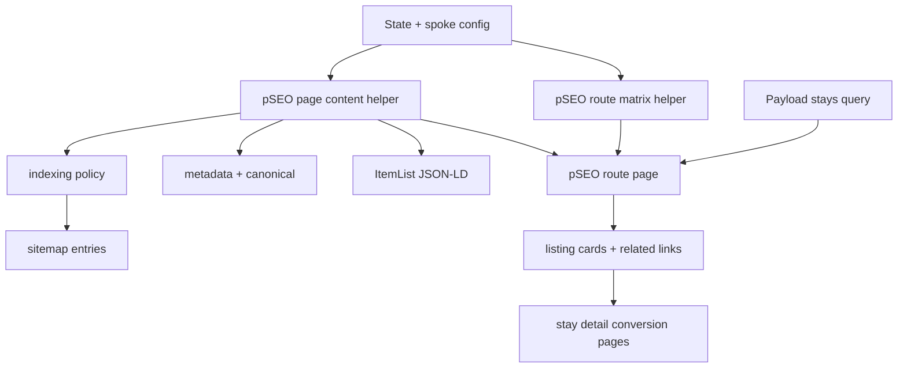

# feat: Harden pSEO intersection pages

## Summary

This plan turns the initial `/[spoke]/[state]` implementation into a maintainable, crawl-ready pSEO layer. The work extracts shared page-generation logic, formalizes thin-page behavior, strengthens internal linking, makes sitemap inclusion safer, and adds focused tests that verify the 250-page route matrix without relying on a full production build.

---

## Problem Frame

The first pSEO slice created the core spoke-by-state route and added the 250 URLs to the sitemap. That proves the architecture, but the implementation still needs a second pass before it is a durable SEO asset: page copy and metadata logic live inside the route, sitemap inclusion is unconditional, empty pages can become thin indexable URLs, and there is no dedicated coverage for route generation, structured data, or internal-link behavior.

The GTM strategy identifies Tier 2 spoke x state pages as the main programmatic SEO lever, while the content architecture positions them as database-generated discovery pages distinct from Journal articles and single-stay conversion pages.

---

## Requirements

- R1. Preserve the 5 top-level spoke hubs and the 250 spoke x state URL model: `/[spoke]/[state]`.
- R2. Keep programmatic pages separate from `/journal`; they are database-generated landing pages, not CMS-authored editorial posts.
- R3. Each valid intersection page must produce stable SEO metadata, canonical URL, unique intro copy, listings, related links, and `ItemList` structured data.
- R4. Empty or low-inventory intersections must have an explicit indexing and sitemap policy so the site does not invite search engines into thin pages by accident.
- R5. Internal links should help crawlers and users move between spoke hubs, state intersections, and stay detail conversion pages.
- R6. Verification must cover the route matrix, metadata/content helpers, structured data shape, and sitemap inclusion rules without depending exclusively on `next build`.

---

## Scope Boundaries

- No new page family beyond the existing `/[spoke]/[state]` intersections.
- No city guide generation, Journal authoring workflow, or `/journal` URL model changes.
- No `/stays/[slug]` redesign; stay detail pages remain the conversion surface that pSEO pages route into.
- No Payload schema change or migration unless implementation discovers the current fields cannot support the sitemap/indexing policy.
- No Search Console submission, keyword research, or analytics dashboard setup in this slice.

### Deferred to Follow-Up Work

- Search Console submission and monitoring: separate operational task once sitemap behavior is finalized.
- pSEO performance pre-warming: separate infrastructure task if production build/runtime metrics show cache misses are material.
- CMS-managed custom intros or state-level editorial overrides: future content tooling if generated copy is not enough.
- City or region programmatic pages: future pSEO expansion after the state intersections are stable.

---

## Context & Research

### Relevant Code and Patterns

- `src/app/(app)/[spoke]/page.tsx` shows the existing App Router hub pattern: `dynamicParams = false`, `revalidate = 3600`, `generateStaticParams`, `generateMetadata`, and server component delegation into a content component.
- `src/app/(app)/stays/[slug]/page.tsx` shows a CMS-backed static route pattern with `getAllStaySlugs()`, generated metadata, and related data loading.
- `src/app/(app)/[spoke]/[state]/page.tsx` is the first-slice pSEO route and currently contains route params, metadata, intro copy, JSON-LD, layout, and related-link logic in one file.
- `src/lib/states.ts` defines the 50-state slug/name/region taxonomy and related-state helper.
- `src/lib/spokes-config.ts` defines the 5 canonical spokes and spoke-level SEO copy/config.
- `src/lib/payload-queries.ts` contains cached Payload query helpers, including `getStaysBySpokeAndState()`.
- `src/app/sitemap.ts` currently emits static pages, spoke hubs, all 250 programmatic intersections, stay detail pages, and journal URLs.
- Existing tests use Vitest and Testing Library, with local component mocks in files such as `src/app/(app)/stays/[slug]/_stay/StayDetailContent.test.tsx`.

### Institutional Learnings

- `docs/uniquestays-gtm-strategy.md` names spoke x state pages as the highest-leverage pSEO layer and expects title/meta description automation, unique intros, and ItemList markup.
- `docs/uniquestaysusa-content-architecture.md` frames these pages as ISR-delivered App Router pages backed by Payload, separate from Journal and listing detail pages.
- `docs/plans/2026-05-08-006-feat-journal-blog-plan.md` provides precedent for sitemap inclusion, SEO metadata, canonical URLs, and route generation as plan units.
- `docs/plans/2026-05-08-004-feat-phase4-listing-pages-production-plan.md` provides precedent for static params and ISR-backed listing detail routes.

### External References

- External research skipped. This slice follows local Next.js 16 App Router and Payload patterns already present in the repository.

---

## Key Technical Decisions

- Extract pSEO generation logic out of the route file: route files should orchestrate data loading and rendering, while shared helpers own state/spoke validation, metadata copy, intro copy, JSON-LD, route matrix generation, and indexing policy.
- Treat thin-page policy as a first-class decision: sitemap inclusion and robots metadata should be driven by the same helper so pages do not accidentally disagree with the sitemap.
- Keep the first implementation static-param based: the route matrix is only 250 pages, so explicit static params are simple, auditable, and aligned with existing route patterns.
- Prefer tests around pure helpers and route outputs over broad production builds: `pnpm build` previously hung in this environment, while `next typegen`, `tsc`, and Vitest all completed reliably.
- Preserve the current visual system: pSEO hardening should refine behavior and maintainability, not redesign the page or introduce a new component library.

---

## Open Questions

### Resolved During Planning

- Should the second slice add another page family? No. The next useful step is hardening the existing Tier 2 layer before adding city/region pages.
- Should programmatic pages live under `/journal`? No. The docs and user direction keep generated landing pages separate from CMS-authored editorial posts.
- Should every one of the 250 URLs stay valid? Yes, but index/sitemap treatment should depend on page quality and inventory.

### Deferred to Implementation

- Exact inventory threshold for indexability: implementation should choose a conservative default after inspecting available seeded data, then centralize it so Jon can adjust it in one place.
- Exact helper file split: implementation should keep files small, but final names can follow what feels clean once functions are moved out of the route.
- Exact browser verification path: depends on whether local server binding is available in the executor environment.

---

## High-Level Technical Design

> *This illustrates the intended approach and is directional guidance for review, not implementation specification. The implementing agent should treat it as context, not code to reproduce.*

---

## Implementation Units

### U1. Extract Shared pSEO Helpers

**Goal:** Move pSEO-specific route matrix, validation, metadata, intro, structured-data, and policy logic into reusable server-safe helpers.

**Requirements:** R1, R3, R4, R6

**Dependencies:** None

**Files:**
- Create: `src/lib/pseo.ts`
- Test: `src/lib/pseo.test.ts`
- Modify: `src/app/(app)/[spoke]/[state]/page.tsx`
- Modify: `src/app/sitemap.ts`

**Approach:**
- Centralize the canonical route matrix for all 5 spokes x 50 states.
- Expose helpers for resolving a route context from `spoke` and `state` params.
- Move title, description, intro-copy, canonical-path, and JSON-LD construction out of the page file.
- Add a single policy helper that can answer whether an intersection should be indexable and sitemap-eligible based on inventory and route validity.
- Keep the helpers framework-light where possible so Vitest can exercise behavior without rendering the full Next page.

**Execution note:** Implement helper tests first because this unit defines the contract for later sitemap and route work.

**Patterns to follow:**
- `src/lib/states.ts` for simple typed config helpers.
- `src/lib/spokes-config.ts` for canonical spoke data.
- `src/app/(app)/[spoke]/page.tsx` for keeping route files thin.

**Test scenarios:**
- Happy path: route matrix helper returns exactly 250 entries from the 5 canonical spokes and 50 canonical states.
- Happy path: resolving `pet-friendly/california` returns the pet-friendly spoke config and California state config.
- Edge case: resolving an unknown spoke returns a non-valid result that callers can route to `notFound()`.
- Edge case: resolving an unknown state returns a non-valid result that callers can route to `notFound()`.
- Happy path: metadata helper for `pet-friendly/california` produces title text containing `Pet-Friendly Stays in California` and a canonical path of `/pet-friendly/california`.
- Happy path: JSON-LD helper emits `ItemList` with positions matching listing order and stay detail URLs under `/stays/[slug]`.
- Edge case: JSON-LD helper handles missing ratings and images without emitting misleading empty rating objects.
- Policy: a page with enough matching stays is indexable and sitemap-eligible.
- Policy: a valid route with no matching stays is valid but not sitemap-eligible under the chosen policy.

**Verification:**
- pSEO helper behavior is covered by focused unit tests.
- The route page imports helper behavior instead of carrying duplicated generation logic inline.

---

### U2. Apply Thin-Page Policy to Route Metadata

**Goal:** Ensure valid-but-thin intersections are handled deliberately in metadata rather than silently becoming low-value indexable pages.

**Requirements:** R3, R4

**Dependencies:** U1

**Files:**
- Modify: `src/app/(app)/[spoke]/[state]/page.tsx`
- Test: `src/lib/pseo.test.ts`

**Approach:**
- Use the shared policy helper after loading matching stays to determine robots behavior for the page.
- Keep all valid route combinations renderable so internal links and future inventory can resolve cleanly.
- For pages below the chosen quality threshold, return metadata that discourages indexing while still allowing users to browse the fallback content.
- Keep invalid spoke/state params as `notFound()` via the route context resolver.

**Patterns to follow:**
- `src/app/(app)/stays/[slug]/page.tsx` for generated metadata based on loaded page data.
- `src/app/(app)/[spoke]/[state]/page.tsx` first-slice fallback content for no-stay states.

**Test scenarios:**
- Happy path: an inventory-rich route remains indexable and keeps canonical metadata.
- Edge case: a valid route with zero stays returns robots metadata consistent with the noindex policy.
- Error path: an invalid route context does not attempt to generate normal SEO metadata.
- Integration: route metadata and sitemap policy use the same helper result for the same stay count.

**Verification:**
- Metadata behavior is deterministic for rich, thin, and invalid route states.
- There is one shared policy source for route metadata and sitemap logic.

---

### U3. Strengthen Internal Linking

**Goal:** Improve crawl paths and user navigation between spoke hubs, state intersections, and stay detail pages without turning the page into a link farm.

**Requirements:** R1, R3, R5

**Dependencies:** U1

**Files:**
- Modify: `src/app/(app)/[spoke]/page.tsx`
- Modify: `src/app/(app)/[spoke]/_spoke/SpokeContent.tsx`
- Modify: `src/app/(app)/[spoke]/[state]/page.tsx`
- Test: `src/app/(app)/[spoke]/_spoke/SpokeContent.test.tsx`
- Test: `src/lib/pseo.test.ts`

**Approach:**
- Add a state-browse section to each top-level spoke hub so crawlers can discover intersection URLs from the hub.
- Keep the state list compact and scan-friendly, with canonical state names and links generated from the same route matrix helper.
- Keep intersection-page related links focused: nearby/same-region states for the same spoke and sibling spokes for the same state.
- Preserve stay cards as the primary conversion path into `/stays/[slug]`.

**Patterns to follow:**
- Existing cross-link section in `src/app/(app)/[spoke]/_spoke/SpokeContent.tsx`.
- Existing related-spoke and related-state sections in `src/app/(app)/[spoke]/[state]/page.tsx`.

**Test scenarios:**
- Happy path: the pet-friendly hub renders links to canonical state URLs such as `/pet-friendly/california`.
- Edge case: generated state links use slugs from `src/lib/states.ts`, not display-name transformations in the component.
- Happy path: a state intersection links to sibling spoke intersections for the same state.
- Happy path: a state intersection links to related same-region states for the current spoke.
- Integration: stay cards on intersection pages continue linking to `/stays/[slug]` rather than affiliate URLs.

**Verification:**
- Each spoke hub provides crawlable links into state intersections.
- Intersection pages continue routing users toward stay detail pages and adjacent discovery pages.

---

### U4. Make Sitemap Inclusion Policy-Aware

**Goal:** Keep sitemap output aligned with route validity and indexability so search engines receive a clean set of URLs.

**Requirements:** R1, R4, R6

**Dependencies:** U1, U2

**Files:**
- Modify: `src/app/sitemap.ts`
- Test: `src/app/sitemap.test.ts`

**Approach:**
- Replace unconditional programmatic URL emission with policy-aware pSEO sitemap entries.
- Prefer a helper that can generate all possible valid route entries and filter them based on policy inputs.
- If the sitemap needs stay counts to decide eligibility, keep data access bounded and avoid 250 separate Payload queries.
- Preserve existing sitemap entries for home, collection, spoke hubs, stay details, and Journal posts.
- Normalize `NEXT_PUBLIC_SERVER_URL` once and reuse it across all sitemap URL construction.

**Patterns to follow:**
- Existing `src/app/sitemap.ts` `MetadataRoute.Sitemap` shape.
- `getAllStaySlugs()` and `getAllJournalSlugs()` as lightweight sitemap data sources.

**Test scenarios:**
- Happy path: sitemap includes all spoke hub URLs.
- Happy path: sitemap includes an eligible `/pet-friendly/california` entry when policy input says it has enough inventory.
- Edge case: sitemap omits a valid but noindex pSEO URL when policy input says it is thin.
- Edge case: sitemap still returns static, stay, and Journal URLs when no pSEO URL qualifies.
- Error path: base URL with a trailing slash does not produce double slashes in generated URLs.

**Verification:**
- Sitemap entries and route metadata agree on which pSEO pages should be indexable.
- Sitemap tests exercise URL construction without requiring live Payload access for every route.

---

### U5. Add Targeted Verification and Documentation

**Goal:** Document the second-slice behavior and provide a reliable verification path that works even when full build or local server smoke tests are unavailable.

**Requirements:** R2, R4, R6

**Dependencies:** U1, U2, U3, U4

**Files:**
- Modify: `docs/uniquestays-gtm-strategy.md`
- Modify: `docs/uniquestaysusa-content-architecture.md`
- Test: `src/lib/pseo.test.ts`
- Test: `src/app/sitemap.test.ts`
- Test: `src/app/(app)/[spoke]/_spoke/SpokeContent.test.tsx`

**Approach:**
- Add concise documentation notes explaining the pSEO route policy, including why programmatic pages do not live in `/journal`.
- Document the index/sitemap threshold and where to adjust it.
- Record the intended verification stack: route type generation, TypeScript, focused unit/component tests, and browser smoke testing when server binding is available.
- Avoid documenting environment-specific failures as permanent project behavior; frame them as executor constraints.

**Patterns to follow:**
- Existing strategy docs for product rationale.
- Existing Vitest tests for focused behavior checks.

**Test scenarios:**
- Test expectation: no new behavioral test solely for documentation edits. The behavior is covered by U1-U4 tests.

**Verification:**
- Docs explain the policy clearly enough for a future implementer to adjust pSEO behavior without rereading the whole route.
- The verification checklist covers route generation, sitemap behavior, and representative page rendering.

---

## System-Wide Impact

- **Interaction graph:** App Router pages, sitemap generation, Payload stay queries, and reusable pSEO helpers become linked by one policy layer.
- **Error propagation:** Invalid route params should still resolve to `notFound()`; valid thin routes should render but carry noindex/sitemap exclusion under the chosen policy.
- **State lifecycle risks:** New stays can change a page from thin to indexable after cache revalidation; policy helpers must make that transition deterministic.
- **API surface parity:** Public URL structure stays unchanged. No Payload REST API contract changes are planned.
- **Integration coverage:** Route helper tests and sitemap tests cover the pSEO matrix; browser smoke tests remain desirable for final visual confidence when an environment permits local server binding.
- **Unchanged invariants:** Top-level spoke hubs remain `/unique`, `/work-friendly`, `/pet-friendly`, `/rv-ready`, and `/ev-ready`; stay conversion pages remain under `/stays/[slug]`; Journal remains CMS-authored editorial content.

---

## Risks & Dependencies

| Risk | Mitigation |
|------|------------|
| Thin pages get indexed before there is enough inventory | Centralize index/sitemap policy and apply it to metadata and sitemap generation together |
| Sitemap generation becomes expensive if it queries each intersection separately | Prefer aggregated or already-loaded stay data for policy decisions; avoid 250 individual Payload calls |
| Route helpers drift from spoke/state config | Generate the matrix from `SPOKE_SLUGS` and `STATES` rather than duplicating arrays |
| Tests become too coupled to display copy | Assert stable SEO-critical phrases and route behavior, not every sentence of intro prose |
| Full production build remains unreliable in the executor environment | Treat `next typegen`, `tsc`, Vitest, and targeted browser smoke tests as the default verification stack; run full build where the environment supports it |

---

## Documentation / Operational Notes

- Update strategy/content architecture docs only with durable implementation policy, not temporary implementation trivia.
- After implementation, submit the final sitemap in Google Search Console as a separate operational task.
- If production build remains slow or hangs, capture the failure separately as a build-performance investigation rather than blocking this pSEO hardening plan.

---

## Sources & References

- GTM strategy: `docs/uniquestays-gtm-strategy.md`
- Content architecture: `docs/uniquestaysusa-content-architecture.md`
- Current pSEO route: `src/app/(app)/[spoke]/[state]/page.tsx`
- State taxonomy: `src/lib/states.ts`
- Spoke config: `src/lib/spokes-config.ts`
- Payload queries: `src/lib/payload-queries.ts`
- Sitemap: `src/app/sitemap.ts`
- Route pattern: `src/app/(app)/[spoke]/page.tsx`
- Listing detail route pattern: `src/app/(app)/stays/[slug]/page.tsx`
