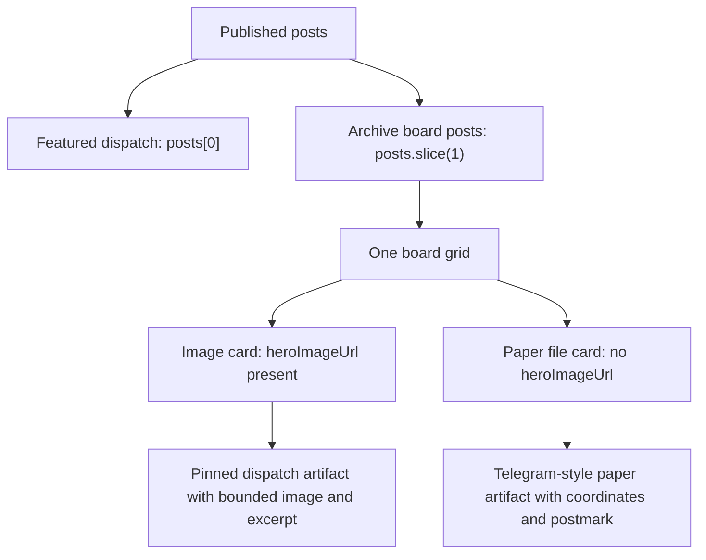

# fix: Recompose Journal Dispatch Board

## Summary

Rework the `/journal` homepage below the featured dispatch into one composed dispatch board instead of a duplicated ledger plus dossier grid. The fix removes the competing "Recently filed" rail, renders non-featured posts once in an asymmetric archive board, and treats missing-image posts as intentional paper artifacts rather than oversized image placeholders.

---

## Problem Frame

The current journal index fulfills the basic dispatch-board direction, but the recently filed and non-featured sections undermine it: the same posts appear twice, the left rail competes with the primary archive, and the large dossier cards produce blank vertical whitespace when only a few posts exist. This makes the board feel like component output instead of a curated editorial artifact. (see origin: `docs/brainstorms/2026-05-08-journal-requirements.md`)

---

## Requirements

- R1. Preserve the origin requirement that `/journal` is a dispatch board, not a standard blog listing.
- R2. Render each published post at most once below the featured dispatch.
- R3. Replace the `Recently filed` ledger rail with a single board composition for all non-featured posts.
- R4. Keep the analog travel-artifact language: pinned index cards, postmarks, terracotta accents, cream/cork paper surface, slight rotation.
- R5. Reduce visual noise by reserving pins, stamps, shadows, and rotations for hierarchy, not every element equally.
- R6. Prevent oversized empty cards by using fixed, responsive card proportions and distinct paper-only treatment for posts without hero images.
- R7. Preserve accessible link semantics, readable heading hierarchy, visible focus states, and reduced-motion behavior.
- R8. Verify the revised board visually on desktop and mobile, including the screenshot region that exposed the issue.

**Origin actors:** Primary reader, secondary reader.
**Origin flows:** `/journal` index page discovery, click through to a field dispatch.
**Origin acceptance examples:** The index is a dispatch board of pinned index cards; no one should mistake the journal for a generic travel blog.

---

## Scope Boundaries

- Do not change Payload schemas, migrations, journal query behavior, or published content ordering.
- Do not redesign the top journal hero or featured dispatch unless a small spacing adjustment is required to make the new board composition connect cleanly.
- Do not change `/journal/[slug]` post template styling.
- Do not add tags, filters, pagination, search, or `/journal/[state]/[city]` pages.
- Do not introduce a new design system or new typography choices.
- Do not use dark mode, gradient text, glassmorphism, or generic card-grid treatment.

### Deferred to Follow-Up Work

- Journal archive filtering or grouping once post volume grows beyond the current small set.
- Editorial art direction for each individual journal post card beyond the data already available from `heroImageUrl`, city, state, coordinates, and excerpt.
- Uploading better hero images for posts that currently rely on fallback treatment.

---

## Context & Research

### Relevant Code and Patterns

- `src/app/(app)/journal/_journal/JournalContent.tsx` currently computes `featured = posts[0]`, `rest = posts.slice(1)`, and `recentPosts = posts.slice(0, 5)`. This is the source of duplicate post rendering below the featured dispatch.
- `src/app/(app)/globals.css` contains all journal index styling under the `/* Journal archive */` section, including board, ledger, dossier, mobile, and reduced-motion rules.
- `src/app/(app)/journal/page.tsx` already supplies published posts from `getAllJournalPosts()`, so the fix should remain a presentation-only refactor.
- `src/app/(app)/stays/[slug]/_stay/StayDetailContent.test.tsx` and `src/app/(app)/[spoke]/_spoke/SpokeContent.test.tsx` show the local Vitest + Testing Library pattern for client component tests with mocked `next/image` and `next/link`.
- `PRODUCT.md` defines the journal index as a board, not a list, and emphasizes analog warmth, editorial restraint, and brand coherence across details.

### Institutional Learnings

- Use `pnpm` for all project commands; npm is intentionally blocked by `devEngines`.
- Next.js 16 App Router rules apply; read local `node_modules/next/dist/docs/` before changing framework APIs. This plan avoids framework API changes.
- Visual frontend changes should be checked with browser screenshots across desktop and mobile.

### External References

- Not used. The existing codebase, product context, and screenshot critique provide enough grounding for this bounded frontend refactor.

---

## Key Technical Decisions

- **Single-board composition:** Remove the ledger/dossier split and render `rest` once in a unified archive board. This directly fixes duplicate content and restores the board metaphor.
- **Tiered card variants inside one component family:** Keep one `DispatchCard` responsibility, but allow visual variants based on index and available imagery: a medium feature-like card, compact paper cards, and paper-only fallback cards. This creates rhythm without adding an unrelated component system.
- **Fallback as telegram sheet, not image placeholder:** Posts without `heroImageUrl` should not render the large striped image block. They should become paper files with coordinate/postmark emphasis, so missing images read as intentional editorial artifacts.
- **Responsive CSS grid, not masonry JavaScript:** Use CSS grid with stable track sizes and variant classes. This keeps performance and accessibility aligned with the journal's native-first design principles.
- **Decoration budget:** Keep pins and stamps, but reduce their default density. Every card does not need every artifact treatment at maximum weight.

---

## Open Questions

### Resolved During Planning

- **Should the selected direction be Solution 2?** Yes. The user chose Solution 2: one dispatch board, no separate ledger.
- **Is this a schema/content task?** No. The issue is visual hierarchy and section composition in the journal index.
- **Is external design research needed?** No. The product and journal requirements already define the visual metaphor and anti-patterns.

### Deferred to Implementation

- **Exact card tier count for the current post volume:** Implementation should tune the breakpoint and tier behavior after seeing live desktop and mobile screenshots.
- **Whether old ledger CSS should be deleted or left temporarily:** Implementation should remove dead CSS when safe, but can keep it only if another active route/component still references it.
- **Precise fallback copy for image-less posts:** Implementation should choose concise labels that fit available card space without adding explanatory UI text.

---

## High-Level Technical Design

> *This illustrates the intended approach and is directional guidance for review, not implementation specification. The implementing agent should treat it as context, not code to reproduce.*

---

## Implementation Units

### U1. Recompose JournalContent Around A Single Archive Board

**Goal:** Remove duplicate post rendering and restructure the index markup so all non-featured posts render once in one board.

**Requirements:** R1, R2, R3, R7

**Dependencies:** None

**Files:**
- Modify: `src/app/(app)/journal/_journal/JournalContent.tsx`
- Test: `src/app/(app)/journal/_journal/JournalContent.test.tsx`

**Approach:**
- Remove the `recentPosts` slice and the `MiniPostCard` ledger path from the active render tree.
- Replace `journal-board__lower`, `journal-ledger`, and `dispatch-dossier-grid` markup with one archive section below the featured dispatch.
- Keep `featured = posts[0]` and `rest = posts.slice(1)` as the data boundary.
- Rename or reshape labels so the section communicates a single archive board, not two feeds competing for attention.
- Keep semantic structure: one section for published dispatches, individual linked articles for cards, and accessible link labels through visible titles.

**Patterns to follow:**
- Existing `DispatchCard` and `PostmarkSVG` patterns in `src/app/(app)/journal/_journal/JournalContent.tsx`.
- Existing Testing Library mocks for `next/image` and `next/link` in `src/app/(app)/stays/[slug]/_stay/StayDetailContent.test.tsx`.

**Test scenarios:**
- Happy path: render five posts, expect the featured title once and each non-featured title exactly once.
- Happy path: render one post, expect the featured dispatch and no empty archive board shell.
- Edge case: render zero posts, expect the existing empty-state copy and no featured/archive cards.
- Edge case: render posts with duplicate-looking excerpts but unique titles, expect title-based links to remain distinct and clickable.

**Verification:**
- The rendered `/journal` page no longer shows the same non-featured post in both a left ledger and a right grid.
- The component test proves post duplication is removed at the markup level.

---

### U2. Define Archive Card Variants And Fallback Treatment

**Goal:** Give the unified board enough editorial rhythm without returning to a generic equal-card grid or oversized blank dossiers.

**Requirements:** R1, R4, R5, R6, R7

**Dependencies:** U1

**Files:**
- Modify: `src/app/(app)/journal/_journal/JournalContent.tsx`
- Test: `src/app/(app)/journal/_journal/JournalContent.test.tsx`

**Approach:**
- Evolve `DispatchCard` so it can assign a stable visual variant from the post index and image availability.
- Use one medium card for the first non-featured dispatch when enough posts exist, followed by compact cards for the rest.
- For image-backed cards, keep an image area but cap its aspect ratio and prevent the body from stretching into large blank space.
- For posts without `heroImageUrl`, render a paper-file card that leads with file number, coordinates/location, title, excerpt, and postmark, without a large striped image placeholder.
- Preserve `PostmarkSVG` reuse and `MapPin` only where it helps the paper-file artifact, not as a centered missing-image marker.

**Patterns to follow:**
- Existing `PostmarkSVG` helper in `src/app/(app)/journal/_journal/JournalContent.tsx`.
- Existing journal card copy fields: `title`, `excerpt`, `city`, `state`, `latitude`, `longitude`, `publishedAt`.

**Test scenarios:**
- Happy path: image-backed post renders an image with the post title as alt text.
- Happy path: image-less post renders no mocked `next/image` element and still exposes a link with the post title.
- Edge case: missing city/state/coordinates falls back to `Undisclosed location` without layout-only placeholder text.
- Edge case: long title renders once inside the card link and remains available to assistive technologies.

**Verification:**
- Image-less posts read as intentional paper artifacts rather than missing-image cards.
- Card variants remain deterministic across renders for the same post ordering.

---

### U3. Replace Ledger/Dossier CSS With A Responsive Board System

**Goal:** Implement the selected visual direction in CSS: one asymmetric board with stable card dimensions, reduced decoration density, and no giant empty columns.

**Requirements:** R3, R4, R5, R6, R7, R8

**Dependencies:** U1, U2

**Files:**
- Modify: `src/app/(app)/globals.css`

**Approach:**
- Replace `.journal-board__lower`, `.journal-ledger*`, and old `.dispatch-dossier-grid` rules with a single archive board grid.
- Use responsive CSS grid with bounded tracks and card-level aspect-ratio/min-height constraints so hover states and content differences do not resize the layout.
- Keep the board surface, cream/cork palette, terracotta accent, small rotations, and tactile shadows, but reduce repeated pins and postmarks where they compete.
- Add paper-file card styles for image-less posts.
- Update mobile rules so the archive collapses to a readable single-column board without cramped CTA/meta collisions.
- Preserve `prefers-reduced-motion` coverage for all revised card classes.

**Patterns to follow:**
- Existing OKLCH journal tokens in `src/app/(app)/globals.css`.
- Existing reduced-motion block in `src/app/(app)/globals.css`.
- Existing journal mobile media query structure.

**Test scenarios:**
- Test expectation: none -- this is styling-only. Behavioral coverage is handled by U1 and U2 tests; visual correctness is verified through screenshots in U4.

**Verification:**
- Desktop screenshot shows one coherent board below the featured dispatch, with no left ledger rail.
- Mobile screenshot shows cards stacked without text overlap, clipped CTAs, or oversized empty image areas.
- Reduced-motion mode still removes transform/transition effects from journal card interactions.

---

### U4. Visual Verification And Polish Pass

**Goal:** Verify the redesigned section against the original screenshot problem and make focused spacing/proportion corrections before calling the plan complete.

**Requirements:** R1, R5, R6, R7, R8

**Dependencies:** U1, U2, U3

**Files:**
- Modify if needed: `src/app/(app)/journal/_journal/JournalContent.tsx`
- Modify if needed: `src/app/(app)/globals.css`

**Approach:**
- Start the local Next.js dev server with `pnpm dev`.
- Capture `/journal` at representative desktop and mobile viewports.
- Inspect the region below the featured dispatch, not only the top hero.
- Compare against the problem screenshot: no duplicate posts, no rail/grid competition, no giant blank cards, and no image-less cards pretending to be photos.
- Make only targeted polish changes after screenshots reveal actual issues.

**Patterns to follow:**
- Existing project preference for browser screenshot verification after frontend changes.
- Journal design principles in `PRODUCT.md`.

**Test scenarios:**
- Integration: desktop viewport loads `/journal`, shows the featured dispatch and unified archive board with no duplicate visible titles.
- Integration: mobile viewport loads `/journal`, shows archive cards in one column with readable titles, metadata, and CTA/link affordances.
- Accessibility check: keyboard focus reaches each archive card link and the focus state is visible against the board surface.
- Motion check: when reduced motion is enabled, hover/focus styling does not rely on animated transforms.

**Verification:**
- Save or inspect screenshots for desktop and mobile.
- `pnpm test` passes for the new/updated component tests.
- No visual regression is introduced in the featured dispatch or empty state.

---

## System-Wide Impact

- **Interaction graph:** Presentation-only change inside `/journal`; route loading, Payload queries, and detail pages are unchanged.
- **Error propagation:** No new data fetching or async errors are introduced.
- **State lifecycle risks:** Post ordering still comes from `getAllJournalPosts()`; card variants should derive from array order and image availability only.
- **API surface parity:** No API, schema, or route contract changes.
- **Integration coverage:** Browser verification is required because CSS proportions and responsive layout are the main risk.
- **Unchanged invariants:** `/journal/[slug]` URLs, published-post filtering, metadata, sitemap behavior, and featured-post selection remain unchanged.

---

## Risks & Dependencies

| Risk | Mitigation |
|------|------------|
| The unified board becomes a generic card grid after removing the ledger. | Use tiered variants, paper-file fallback treatment, subtle rotations, and postmarks to preserve the dispatch-board metaphor. |
| Image-less posts still feel broken. | Do not render a large placeholder image area for them; style them as telegram/paper files. |
| CSS cleanup accidentally removes styles used by related journal cards or post pages. | Search class usage before deleting and keep changes scoped to index-only class names. |
| Desktop looks fixed but mobile becomes cramped. | U4 requires mobile screenshot verification and explicit text-overlap checks. |
| Tests overfit decorative class names. | Component tests should assert content uniqueness, link presence, and image/fallback behavior rather than exact CSS implementation. |

---

## Documentation / Operational Notes

- No schema, migration, environment variable, or Payload admin work is expected.
- No public content needs to change.
- If the implementation removes ledger classes entirely, mention that in the PR summary so reviewers know the removal is intentional.

---

## Sources & References

- **Origin document:** [docs/brainstorms/2026-05-08-journal-requirements.md](../brainstorms/2026-05-08-journal-requirements.md)
- Existing journal implementation: `src/app/(app)/journal/_journal/JournalContent.tsx`
- Existing journal styling: `src/app/(app)/globals.css`
- Journal route entry: `src/app/(app)/journal/page.tsx`
- Product/design context: `PRODUCT.md`
- Existing component test pattern: `src/app/(app)/stays/[slug]/_stay/StayDetailContent.test.tsx`
