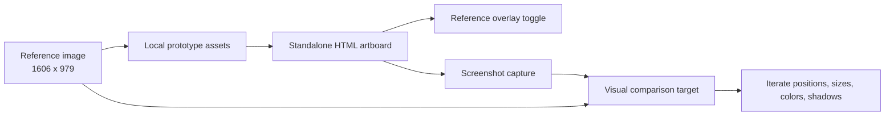

# feat: Build pixel-matched journal hero prototype

## Summary

Create a standalone HTML prototype that recreates the supplied Wayfinder Journal hero image at its native `1606 x 979` canvas size, using layered HTML/CSS for the typography, cinematic mountain backdrop, pinned polaroids, dotted route lines, buttons, and paper details. Keep the prototype isolated from the live `/journal` implementation until the visual match is accepted.

---

## Problem Frame

The Journal requirements call for an immediately recognizable dispatch-board identity rather than generic travel-blog UI (see origin: `docs/brainstorms/2026-05-08-journal-requirements.md`). The supplied image sharpens that direction into a specific art-directed hero: dark alpine depth, giant editorial serif type, warm italic accent line, and travel-photo artifacts arranged across a single cinematic viewport.

---

## Requirements

- R1. The prototype must visually match the supplied reference image as closely as HTML/CSS allows at `1606 x 979`.
- R2. The first viewport must preserve the exact composition hierarchy: eyebrow, two-line headline, subcopy, two CTAs, three pinned polaroids, route dots, and dark mountain landscape.
- R3. Typography must follow the reference hierarchy: oversized cream serif display line, peach italic serif accent line, small letter-spaced sans eyebrow, and compact sans body/CTA text.
- R4. Polaroids must reproduce the reference proportions, rotations, pin placement, shadows, photo crops, warm paper tone, handwritten captions, and small heart/leaf marks.
- R5. The prototype must be static and reviewable without Payload data, CMS queries, or changes to production journal routes.
- R6. Visual verification must compare screenshots against the reference at desktop and mobile-friendly widths, with the native canvas as the primary acceptance target.
- R7. Existing `/journal` implementation and journal archive behavior must remain unchanged during prototype work.

**Origin actors:** Primary reader, Secondary reader
**Origin flows:** Journal index as a dispatch board; editorial discovery leading toward story engagement
**Origin acceptance examples:** Design is immediately distinguishable from generic travel blogs; light-only analog travel artifact aesthetic

---

## Scope Boundaries

- Do not replace the live `src/app/(app)/journal/_journal/JournalHero.tsx` in this plan.
- Do not alter Payload collections, blog post data, journal routing, sitemap behavior, or ISR behavior.
- Do not build a reusable component system before the visual target is approved.
- Do not make a new landing page or marketing page; this is a prototype of the hero artwork itself.
- Do not depend on remote image URLs for the reference-critical assets once the prototype is committed.

### Deferred to Follow-Up Work

- Integrating the approved prototype into `JournalHero.tsx`.
- Refactoring repeated hero/polaroid CSS into shared production tokens.
- Replacing reference-derived imagery with licensed final photography if the prototype uses cropped assets from the supplied image for match fidelity.
- Adding CMS-driven story cards or live post routing inside the hero.

---

## Context & Research

### Relevant Code and Patterns

- `src/app/(app)/journal/_journal/JournalHero.tsx` already contains a full-bleed journal hero with background image, text block, polaroid stage, route SVG, pins, and CTAs.
- `src/app/(app)/globals.css` contains the current `.journal-hero*` rules, including `journal-hero__stage`, `journal-hero__polaroid`, route path animation, reduced-motion handling, and the `--journal-hero-serif` display-font token.
- `prototypes/` contains several standalone HTML journal hero explorations, including `journal-hero-v1-cinematic.html`, `journal-hero-c-postcard.html`, and related analog/polaroid treatments.
- `prototypes/journal-option-a-editorial.html` demonstrates the existing standalone prototype style: embedded HTML/CSS, Google font loading, fixed art direction, polaroid treatments, pin dots, and responsive breakpoints.
- `PRODUCT.md` reinforces the brand constraints: Wanderer, Editorial, Nostalgic, light-only, analog warmth, polaroids, postage stamps, filmstrips, grain, and editorial restraint.
- `node_modules/next/dist/docs/01-app/01-getting-started/12-images.md` confirms local images can live under `public/` and be referenced by absolute web paths.
- `node_modules/next/dist/docs/01-app/01-getting-started/11-css.md` confirms the existing global CSS/Tailwind setup pattern.
- `node_modules/next/dist/docs/01-app/01-getting-started/13-fonts.md` confirms Next's production preference for optimized fonts, though standalone prototypes may use direct font links for speed.

### Institutional Learnings

- No `docs/solutions/` directory exists yet.
- Recent journal plans in `docs/plans/2026-05-11-011-feat-journal-polaroid-grid-plan.md` and `docs/plans/2026-05-10-010-fix-journal-dispatch-board-plan.md` show that journal visual work is being staged as isolated, reviewable slices.

### External References

- External web research was skipped. Local prototypes, product guidance, the supplied reference image, and bundled Next 16 documentation are sufficient for this plan.

---

## Key Technical Decisions

- **Standalone prototype first:** Build under `prototypes/` so the work can chase pixel fidelity without destabilizing live journal code.
- **Native reference canvas as source of truth:** Treat `1606 x 979` as the primary artboard. The desktop prototype should use a fixed-ratio stage that scales down responsively rather than reflowing the composition at the primary acceptance size.
- **Layered HTML/CSS over immediate production React:** Use semantic prototype sections, absolute-positioned art layers, CSS variables, and local assets. React integration comes after visual approval.
- **Reference-derived asset workflow allowed for fidelity:** For the closest match, crop or prepare local assets from the supplied reference image and store them under `public/prototypes/journal-hero-pixel-match/`. This preserves the visual target while making asset provenance explicit.
- **Visual diff over DOM unit tests:** The prototype has no business logic. Acceptance should lean on screenshots and measured visual comparison rather than unit tests.
- **Keep a reference overlay toggle:** Include a review-only overlay mode so the implementer can align text, cards, and paths against the original without leaving the browser.

---

## Open Questions

### Resolved During Planning

- Should this immediately replace the live `/journal` hero? No. The user's request is for an HTML prototype, so the plan isolates prototype work.
- Should the prototype use live Payload posts? No. Exact composition requires fixed art-directed content.
- Should external research be used? No. The local repo already contains the relevant journal prototype and implementation patterns.

### Deferred to Implementation

- Whether the final prototype uses fully cropped reference assets, new generated lookalike images, or a hybrid. The implementer should optimize for visual match first and document the asset choice in the prototype notes.
- The exact tolerance for screenshot diff. The plan calls for visual comparison, but the final threshold should be set after seeing the first rendered baseline.
- Whether mobile should preserve the full poster as a scaled artwork or present a cropped/recomposed version. The native desktop canvas is the primary target.

---

## Output Structure

    prototypes/
      journal-hero-pixel-match.html
    public/
      prototypes/
        journal-hero-pixel-match/
          reference.png
          background.png
          polaroid-lighthouse.png
          polaroid-treehouse.png
          polaroid-dome.png
          verification-desktop.png
          verification-mobile.png

The exact asset filenames may change during implementation if the cropped asset set is different, but the prototype should keep all reference-critical images grouped under one public directory.

---

## High-Level Technical Design

> *This illustrates the intended approach and is directional guidance for review, not implementation specification. The implementing agent should treat it as context, not code to reproduce.*

The prototype should be structured as a single scaled artboard: background layer, dark overlay/grain layer, copy layer, route-line layer, polaroid layer, and optional reference overlay. This preserves compositional control at the native target size.

---

## Implementation Units

### U1. Prepare reference assets and prototype shell

**Goal:** Create the standalone prototype file and local asset directory so the visual work has a stable, reviewable target.

**Requirements:** R1, R5, R6

**Dependencies:** None

**Files:**
- Create: `prototypes/journal-hero-pixel-match.html`
- Create: `public/prototypes/journal-hero-pixel-match/reference.png`
- Create or modify: `public/prototypes/journal-hero-pixel-match/background.png`
- Create or modify: `public/prototypes/journal-hero-pixel-match/polaroid-lighthouse.png`
- Create or modify: `public/prototypes/journal-hero-pixel-match/polaroid-treehouse.png`
- Create or modify: `public/prototypes/journal-hero-pixel-match/polaroid-dome.png`

**Approach:**
- Move or copy the supplied reference image into the public prototype asset directory as `reference.png`.
- Create a single HTML file with embedded CSS, matching the repo's existing prototype convention.
- Define a fixed `1606 x 979` artboard inside the page, with responsive scaling for smaller browser widths.
- Add a reference overlay layer that can be toggled for alignment checks and hidden for normal review.
- Prepare cropped or generated image assets for the background and three polaroid photos, keeping all assets local.

**Patterns to follow:**
- `prototypes/journal-option-a-editorial.html` for standalone prototype structure.
- `prototypes/journal-hero-c-postcard.html` for pinned polaroid and postcard treatment.
- `public/` static asset convention from bundled Next image docs.

**Test scenarios:**
- Happy path: Opening `prototypes/journal-hero-pixel-match.html` renders a `1606 x 979` artboard with the reference overlay hidden by default.
- Happy path: Enabling the overlay displays the supplied reference image aligned exactly to the artboard bounds.
- Edge case: Opening the file without the Next dev server still shows local assets through relative or root-safe paths where practical.
- Error path: Missing local assets produce visible fallback blocks or clear alt text rather than invisible empty space.

**Verification:**
- The prototype file opens directly in a browser.
- The reference overlay exactly matches the artboard size.
- All visual assets load from `public/prototypes/journal-hero-pixel-match/` or are embedded in the prototype intentionally.

---

### U2. Recreate the background, typography, and CTA composition

**Goal:** Match the left-side hero composition: dark alpine landscape, top eyebrow, large cream headline, peach italic accent headline, supporting copy, and two buttons.

**Requirements:** R1, R2, R3

**Dependencies:** U1

**Files:**
- Modify: `prototypes/journal-hero-pixel-match.html`
- Modify: `public/prototypes/journal-hero-pixel-match/background.png`

**Approach:**
- Use the prepared background as a full-artboard image, then add CSS overlays for the dark atmospheric gradient, haze, and grain.
- Position the eyebrow near the reference's top-left coordinate with uppercase letter spacing and muted cream color.
- Use Fraunces or the closest available display serif for "Slow mornings." with large optical size, cream color, and tight line height.
- Use the same display family in italic for "Wild places.", with the peach/terracotta color tuned against the reference.
- Place the subcopy and CTA row at fixed artboard coordinates, matching the button widths, rounded pill treatment, opacity, and spacing.
- Keep button text as visual content only; links may point to `#` in the prototype.

**Patterns to follow:**
- `src/app/(app)/globals.css` `.journal-hero__headline`, `.journal-hero__sub`, and `.journal-hero__btn` for existing journal hero treatment.
- `PRODUCT.md` brand tokens for terracotta, cream, forest, and warm charcoal.

**Test scenarios:**
- Happy path: At `1606 x 979`, the headline blocks align with the reference within the agreed visual tolerance.
- Happy path: CTA shapes and text placement match the reference's primary and ghost buttons.
- Edge case: At narrower widths, the full artboard scales without text wrapping or overlapping other layers.
- Accessibility: Decorative background has no meaningful alt text requirement in the static prototype; visible text remains real text rather than baked into the background.

**Verification:**
- Screenshot at native canvas visually matches the left-side text and CTA composition.
- Text remains crisp and selectable.
- Scaling the viewport down preserves composition instead of reflowing the artboard unpredictably.

---

### U3. Recreate polaroids, pins, captions, and route details

**Goal:** Match the three pinned photo cards and the dotted path details across the right and lower-middle portions of the hero.

**Requirements:** R1, R2, R4

**Dependencies:** U1, U2

**Files:**
- Modify: `prototypes/journal-hero-pixel-match.html`
- Modify: `public/prototypes/journal-hero-pixel-match/polaroid-lighthouse.png`
- Modify: `public/prototypes/journal-hero-pixel-match/polaroid-treehouse.png`
- Modify: `public/prototypes/journal-hero-pixel-match/polaroid-dome.png`

**Approach:**
- Build each polaroid as an absolutely positioned card with a warm paper background, thick photo border, lower caption strip, subtle rotation, and shadow matching the reference.
- Use local image assets for the lighthouse, treehouse, and dome photos, cropped to match the visible photo windows.
- Add red pushpins as CSS circles with highlights, shadows, and short pin stems where visible.
- Render handwritten captions using a local fallback stack or a carefully chosen web font in the standalone prototype; tune size, line height, and rotation per caption.
- Add small heart and leaf marks as lightweight inline SVG or CSS-drawn marks.
- Render dotted travel lines as SVG paths behind the cards, with separate light and dark variants to match contrast against background areas.
- Layer cards over paths in the same visual order as the reference: lighthouse lowest, treehouse middle, dome highest/right.

**Patterns to follow:**
- `src/app/(app)/globals.css` `.journal-hero__route-svg`, `.journal-hero__pin`, and `.journal-hero__polaroid` for current layering concepts.
- `prototypes/journal-hero-c-postcard.html` for polaroid paper proportions and pin details.

**Test scenarios:**
- Happy path: Each polaroid card appears at the same approximate size, tilt, and position as the reference at native canvas.
- Happy path: Route dots are visible where expected and pass behind cards without covering text or photo content.
- Edge case: Hidden overflow in photo windows does not distort or stretch the cropped images.
- Edge case: Captions do not overflow the paper caption areas.

**Verification:**
- Native screenshot shows all three cards aligned with the reference overlay.
- Pushpins sit at the same perceived attachment points.
- Dotted paths read as decorative route marks, not as accidental borders or artifacts.

---

### U4. Add visual verification workflow and iterate to acceptance

**Goal:** Make the prototype reviewable through captured screenshots and a repeatable comparison loop.

**Requirements:** R1, R6, R7

**Dependencies:** U1, U2, U3

**Files:**
- Modify: `prototypes/journal-hero-pixel-match.html`
- Create or modify: `public/prototypes/journal-hero-pixel-match/verification-desktop.png`
- Create or modify: `public/prototypes/journal-hero-pixel-match/verification-mobile.png`

**Approach:**
- Use the existing browser automation stack already present in the repo to capture the prototype at `1606 x 979` and at one mobile-friendly viewport.
- Compare the native screenshot to `reference.png` visually using the overlay and, if useful, a simple pixel-diff or perceptual-diff tool.
- Iterate CSS variables for coordinates, scale, color, opacity, blur, shadow, and rotation until the desktop screenshot is acceptably close.
- Save verification screenshots beside the assets so reviewers can inspect the current state without re-running the browser.
- Confirm no live `src/app/(app)/journal` code changed during prototype work.

**Execution note:** Work visually and iteratively. Start with rough layer placement, then tighten one layer at a time against the reference overlay.

**Patterns to follow:**
- Existing `puppeteer-core` dependency in `package.json`.
- Prior local screenshot verification workflow used for journal visual QA.

**Test scenarios:**
- Happy path: Browser capture at `1606 x 979` produces a screenshot with the full artboard visible and no scrollbars cutting off the composition.
- Happy path: Browser capture at mobile width shows a scaled or intentionally cropped prototype with no broken assets.
- Edge case: Reference overlay disabled state is what reviewers see by default.
- Integration: `git diff` after prototype work should show only prototype and prototype asset files unless the user later approves production integration.

**Verification:**
- `verification-desktop.png` is visually close to `reference.png`.
- `verification-mobile.png` proves the prototype remains reviewable on a narrow viewport.
- The live `/journal` page continues to use existing source files unchanged.

---

## System-Wide Impact

- **Interaction graph:** No production route, data fetch, Payload hook, or middleware changes are planned.
- **Error propagation:** Prototype asset failures are local visual failures only; they do not affect the app runtime.
- **State lifecycle risks:** None. The prototype is static.
- **API surface parity:** No API, route, or type contracts change.
- **Integration coverage:** Production integration is explicitly deferred; current coverage is screenshot-based prototype review.
- **Unchanged invariants:** `/journal`, `/journal/[slug]`, sitemap generation, blog post publishing, and Payload collections remain untouched.

---

## Risks & Dependencies

| Risk | Mitigation |
|------|------------|
| True pixel-perfect recreation is impossible with different source imagery or fonts | Use the supplied image as the benchmark, allow reference-derived assets for fidelity, and document any unavoidable differences |
| Prototype accidentally becomes production code before approval | Keep all work under `prototypes/` and `public/prototypes/journal-hero-pixel-match/` |
| Remote fonts or images drift over time | Store reference-critical imagery locally; production integration can later switch to `next/font` |
| Mobile behavior conflicts with desktop pixel fidelity | Treat `1606 x 979` as primary acceptance target and document mobile as a reviewable scaled variant |
| Large image assets bloat the repo | Keep crops scoped to the prototype directory and defer final asset optimization to production integration |

---

## Documentation / Operational Notes

- Add a short comment or visible dev note in the prototype explaining how to toggle the reference overlay.
- Keep prototype-only assets named clearly so later cleanup is straightforward.
- If the prototype becomes the accepted direction, create a follow-up integration plan or work unit that ports it into `JournalHero.tsx` with Next image/font conventions.

---

## Sources & References

- **Origin document:** `docs/brainstorms/2026-05-08-journal-requirements.md`
- **Product guidance:** `PRODUCT.md`
- **Current journal hero:** `src/app/(app)/journal/_journal/JournalHero.tsx`
- **Current journal styles:** `src/app/(app)/globals.css`
- **Prototype precedent:** `prototypes/journal-option-a-editorial.html`
- **Reference image:** `ChatGPT Image May 11, 2026, 09_07_45 PM.png`
- **Next image docs:** `node_modules/next/dist/docs/01-app/01-getting-started/12-images.md`
- **Next CSS docs:** `node_modules/next/dist/docs/01-app/01-getting-started/11-css.md`
- **Next font docs:** `node_modules/next/dist/docs/01-app/01-getting-started/13-fonts.md`
