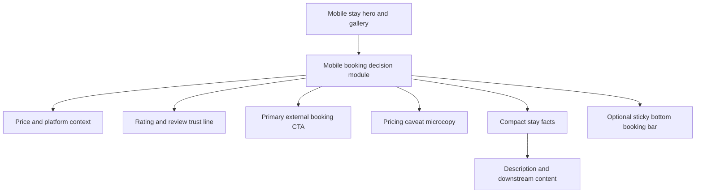

# feat: Refine mobile stay booking module

## Summary

Refine the mobile stay detail booking area so price, rating, review count, pricing caveat, and the outbound booking CTA read as one confident decision module. Keep the existing editorial travel-artifact tone, but reduce mobile ceremony around metadata and trust signals.

---

## Problem Frame

The Impeccable critique found that the current mobile listing detail design has the right visual ingredients, but the grouping is wrong: price and booking live in one card, rating lives in a separate card, and listing metadata is presented as a desktop-like facts row. That makes the mobile decision feel slower than it should. The work should make the mobile user feel ready to tap, without flattening the UniqueStaysUSA brand into a generic rental checkout.

The current target surface is `src/app/(app)/stays/[slug]/_stay/StayDetailContent.tsx`, where the mobile CTA, mobile listing metadata, mobile reviews, and mobile sticky CTA are already implemented separately.

---

## Requirements

### Mobile Booking Decision

- R1. Mobile users see price, rating, review count, platform handoff, and the primary booking CTA as one consolidated decision module.
- R2. The primary mobile CTA remains a sponsored external link to `stay.affiliateUrl`, opens in a new tab, preserves the existing affiliate click analytics, and keeps the platform-specific label.
- R3. The module includes quiet pricing expectation microcopy, such as `Final price shown on Airbnb` or a platform-neutral equivalent, so the listed nightly price does not read as final checkout cost.
- R4. The CTA keeps the terracotta brand accent and external-link expectation, but uses mobile-control typography and touch sizing rather than poster-like tracking.

### Mobile Metadata and Trust

- R5. Location, bedrooms, bathrooms, and capacity are lighter than the booking decision and scan quickly on narrow mobile screens.
- R6. Rating remains available as accessible text, not only decorative stars or color.
- R7. The separate mobile reviews card is removed or collapsed into the booking module unless richer review content is added.

### Scope Preservation

- R8. Desktop ticket-stub booking behavior remains visually and structurally unchanged unless implementation requires a small shared formatting helper.
- R9. No Payload schema, migration, or data model changes are introduced.
- R10. Existing gallery behavior, related stays, spoke details, amenities, FAQs, and analytics event names remain intact.

---

## Key Technical Decisions

- KTD1. Consolidate mobile booking signals in the existing stay detail component: The relevant data and analytics handler already live in `StayDetailContent.tsx`, so the smallest durable change is to recompose the existing mobile blocks before extracting new components.
- KTD2. Treat rating as booking evidence, not a standalone module: The critique explicitly frames rating as trust support for the CTA. Implementation should place `stay.rating` and `stay.reviewCount` near price and CTA, with a textual accessible label.
- KTD3. Keep metadata value-led on mobile: The visual surface should prioritize values like `Bend, Oregon`, `2 bedrooms`, `1 bath`, and `Sleeps 4`; labels may remain for screen-reader semantics but should not dominate visually.
- KTD4. Preserve existing outbound-link and analytics semantics: `handleAffiliateClick`, `target="_blank"`, `rel="noopener noreferrer sponsored"`, and platform labeling are part of the current tracking and affiliate contract.
- KTD5. Keep desktop out of active scope: Desktop already has its own sticky ticket-stub design. Changing it would widen review burden beyond the mobile critique.

---

## High-Level Technical Design

The mobile layout should make the booking decision a single local cluster. The compact facts may sit inside the booking module or directly adjacent to it, but they should not split price, trust, and CTA into separate visual cards.

---

## Scope Boundaries

### In Scope

- Recompose the mobile CTA, rating, price, and metadata blocks in `StayDetailContent.tsx`.
- Add mobile-specific accessible labels and test coverage for the booking module.
- Keep or refine the existing mobile sticky CTA so it reflects the consolidated decision model.

### Deferred to Follow-Up Work

- Larger desktop booking-ticket redesign.
- Rich review snippets, review summary cards, or guest-confidence copy beyond the compact rating line.
- Extracting a broader stay-detail design system from inline styles.
- Visual regression automation if the repo does not already have browser screenshot coverage for this route.

### Out of Scope

- Payload schema changes or migrations.
- New pricing fields for taxes, cleaning fees, availability, or stale-price detection.
- Changes to affiliate disclosure pages or sitewide legal copy.

---

## Implementation Units

### U1. Define mobile booking display helpers

- **Goal:** Centralize the small formatting decisions the mobile module needs so the JSX can stay readable.
- **Requirements:** R1, R3, R5, R6
- **Dependencies:** None
- **Files:**
  - `src/app/(app)/stays/[slug]/_stay/StayDetailContent.tsx`
  - `src/app/(app)/stays/[slug]/_stay/StayDetailContent.test.tsx`
- **Approach:** Add local helper values or small pure helpers for the compact location string, metadata summary, rating label, review count label, and platform-specific price caveat. Keep helpers local to the component unless implementation reveals reuse pressure.
- **Patterns to follow:** Existing `platformLabel`, `categoryDisplay`, and `handleAffiliateClick` derivations in `StayDetailContent.tsx`.
- **Test scenarios:**
  - Render a stay with `rating: 4.9` and `reviewCount: 121`; verify accessible text contains the rating and review count in human-readable form.
  - Render a stay with one bedroom and one bathroom; verify singular labels are used for `1 bedroom` and `1 bath`.
  - Render a stay with a multi-part `location`; verify the compact location still includes city and state.
- **Verification:** The helper output supports the planned mobile module without changing existing desktop strings.

### U2. Consolidate the mobile booking module

- **Goal:** Replace the separate mobile CTA card and mobile reviews card with one decision module that groups price, rating, review count, microcopy, and CTA.
- **Requirements:** R1, R2, R3, R4, R6, R7
- **Dependencies:** U1
- **Files:**
  - `src/app/(app)/stays/[slug]/_stay/StayDetailContent.tsx`
  - `src/app/(app)/stays/[slug]/_stay/StayDetailContent.test.tsx`
- **Approach:** Recompose the mobile section around a single bordered paper block. Put price and trust line above or beside the CTA depending on available width, keep the CTA full-width at comfortable touch height, reduce letter spacing from the current poster treatment, and add quiet pricing microcopy below the CTA. Preserve the existing affiliate link attributes and click handler.
- **Patterns to follow:** Existing OKLCH palette, Fraunces price treatment, Plus Jakarta Sans labels, and terracotta CTA treatment in the mobile block.
- **Test scenarios:**
  - Render the stay and verify there is a mobile booking link with the expected platform label and href.
  - Click the booking link and verify the existing PostHog `affiliate_link_clicked` event still fires with the same payload fields.
  - Verify the booking module includes `$240`, `/night`, rating text, `121 reviews`, and pricing caveat copy in the same rendered section.
  - Render a stay with `rating: null`; verify the booking module still renders price, CTA, and caveat without an empty rating placeholder.
- **Verification:** The mobile booking decision is visually one module and the separate mobile reviews card no longer competes below it.

### U3. Make mobile metadata value-led and compact

- **Goal:** Convert the four labeled metadata columns into a mobile-first compact facts presentation.
- **Requirements:** R5, R8, R10
- **Dependencies:** U1
- **Files:**
  - `src/app/(app)/stays/[slug]/_stay/StayDetailContent.tsx`
  - `src/app/(app)/stays/[slug]/_stay/StayDetailContent.test.tsx`
- **Approach:** Replace the flex-wrapped uppercase label blocks with either a readable summary line or compact chip/grid treatment. The visual copy should lead with values and use labels only where needed for clarity or assistive technology. Keep the facts near the booking module, but subordinate to price and CTA.
- **Patterns to follow:** Existing mobile facts and amenities sections for compact spacing, border rhythm, and warm neutral colors.
- **Test scenarios:**
  - Render the stay and verify location, bedrooms, bath count, and sleeps count remain visible on mobile.
  - Render long city or state strings; verify the planned layout wraps without truncating meaningful text.
  - Verify the metadata change does not remove the desktop metadata rendered in the desktop ticket-stub branch.
- **Verification:** A user can scan the stay facts in one pass without four uppercase labels dominating the mobile block.

### U4. Align the mobile sticky booking bar with the new module

- **Goal:** Ensure the bottom mobile booking affordance, if retained, reinforces the consolidated decision model instead of duplicating the old split structure.
- **Requirements:** R1, R2, R3, R4, R6, R10
- **Dependencies:** U2
- **Files:**
  - `src/app/(app)/stays/[slug]/_stay/StayDetailContent.tsx`
  - `src/app/(app)/stays/[slug]/_stay/StayDetailContent.test.tsx`
- **Approach:** Review the existing mobile sticky CTA below the content and adjust it to carry compact price plus trust context on the left and a concise booking CTA on the right. Preserve safe-area padding and ensure it does not obscure page content. If the current sticky CTA is already structurally close, update copy and visual hierarchy rather than replacing it wholesale.
- **Patterns to follow:** Existing mobile sticky CTA location in `StayDetailContent.tsx`, existing affiliate link attributes, and mobile `lg:hidden` branch.
- **Test scenarios:**
  - Verify the sticky booking link has the same href, target, rel, and click analytics behavior as the primary mobile booking link.
  - Verify the sticky bar includes price and either rating or review context when rating data exists.
  - Render a stay without rating; verify the sticky bar still has stable layout and does not display empty separators.
- **Verification:** After scrolling, the user still has an immediate booking action with enough price or trust context to act.

---

## Acceptance Examples

- AE1. Given a stay with price, rating, and review count, when the mobile stay page renders, then price, rating, reviews, pricing caveat, and `Book on <platform>` appear as one booking decision module.
- AE2. Given a stay without a rating, when the mobile stay page renders, then the booking module still shows price, caveat, and CTA without an empty stars row or awkward separator.
- AE3. Given a user taps either mobile booking link, when the click handler runs, then `affiliate_link_clicked` is captured with the existing stay and affiliate payload fields.
- AE4. Given desktop viewport rendering, when the stay page renders, then the existing desktop ticket-stub layout remains available and is not replaced by the mobile module.

---

## Risks & Dependencies

- **Inline-style density:** `StayDetailContent.tsx` already has a large inline-styled JSX tree. Implementation should avoid making it harder to reason about; small local render helpers may be justified if the booking module gets unwieldy.
- **Responsive evidence:** React tests can prove content and event behavior, but they will not prove mobile composition. Browser screenshots across narrow and mid mobile widths should be part of implementation verification.
- **Sticky overlap:** The mobile sticky bar can obscure the bottom of the page if safe-area padding or trailing content spacing is not preserved.
- **Pricing truthfulness:** The plan can add caveat microcopy, but accurate fees and final pricing remain controlled by the booking platform.

---

## Sources & Research

- `.impeccable/critique/2026-06-02T00-48-49Z__cleanshot-2026-06-01-at-15-20-18-2x-png.md` anchors the product and visual requirements.
- `src/app/(app)/stays/[slug]/_stay/StayDetailContent.tsx` contains the current mobile CTA, metadata, reviews, and sticky CTA sections.
- `src/app/(app)/stays/[slug]/_stay/StayDetailContent.test.tsx` provides the existing React Testing Library and Vitest pattern for this component.
- `node_modules/next/dist/docs/03-architecture/accessibility.md` notes Next.js accessibility expectations, including meaningful labels and accessibility linting.
- `package.json` confirms Next.js 16.2.6, React 19.2.4, Vitest, and Testing Library are the relevant local stack.
